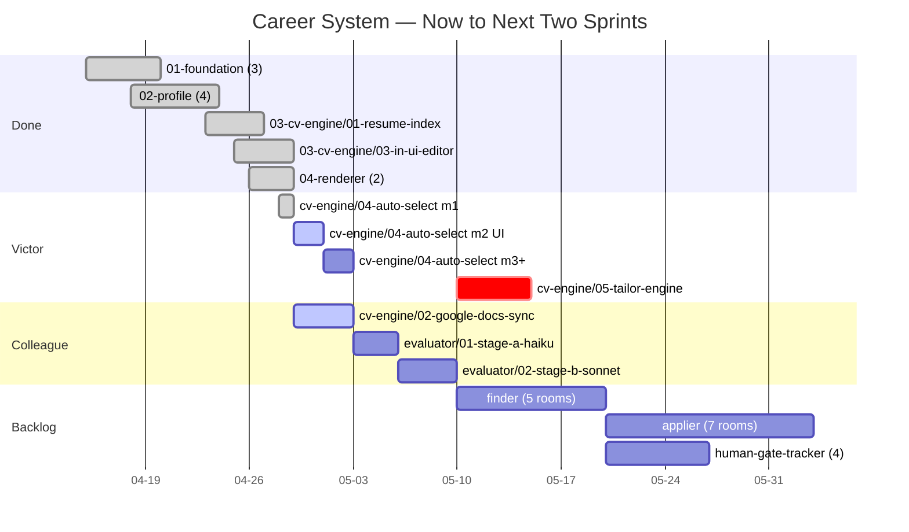
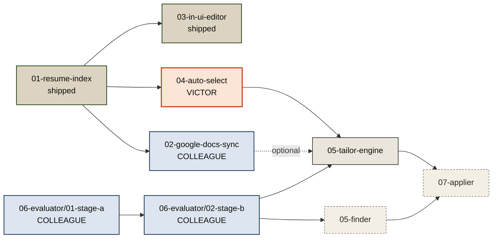

# Career System — Parallel Dispatch

> **Issue Nº 04 · 29 · 26** · Two-engineer cadence
> Repo · `basecamp` · Branch · `main`

A short briefing for synchronizing two engineers across the career-system epic — what's shipped, what's live, where the next hand-offs land.

---

## At a Glance

| | |
|---|---|
| **Active now (Victor)** | `03-cv-engine/04-auto-select` · m2 · 50% · unblocked |
| **Throughput** | 10 / 32 features shipped · 31% complete |
| **Ready for colleague** | `03-cv-engine/02-google-docs-sync` (backend, zero conflict) |
| **Critical path** | `05-tailor-engine` — awaits evaluator stage-b |

---

## § 01 — Rooms with No Blockers

| Room | Owner | Assignment | Note |
|---|---|---|---|
| `03-cv-engine/02-google-docs-sync` | backend | **Colleague** | Only feature both ready and free of overlap with current work |
| `06-evaluator/01-stage-a-haiku` | backend | Colleague · backup | Planning state — start with `plan-milestones` first |
| `06-evaluator/02-stage-b-sonnet` | backend | Colleague · backup | Unlocks downstream `tailor-engine` — high leverage |
| `05-finder/02-job-schema-normalize` | backend | Colleague · backup | Finder upstream; standalone, safe to start cold |

---

## § 02 — Timeline · Two-Lane Cadence



---

## § 03 — Dependency Lattice



---

## § 04 — Orders of Operation

**Order 01 — Start now**
Pick up `03-cv-engine/02-google-docs-sync` first.
Standalone, in the same sub-epic as `resume-index`, so context inherits cleanly. No conflict with Victor's work in flight.

**Order 02 — Up next**
Then `06-evaluator/01-stage-a-haiku` → `02-stage-b-sonnet`.
Highest-leverage sequence — unblocks Victor's `05-tailor-engine`, the bottleneck on the critical path.

**Order 03 — Hold**
Do not touch `05-tailor-engine`, finder, or applier.
Tailor-engine is gated on evaluator stage-b. Finder and applier are further downstream and not yet specced for parallel execution.

---

## § 05 — Colleague Onboarding

```bash
git clone git@github.com:V1ctor2182/basecamp.git
cd basecamp
npm install
# Open Claude Code in this dir, then:
#   /onboard
# 该 slash 命令会装 plugin、导览 repo、推荐第一个 room。
```

**First instruction to Claude:** `dev 02-google-docs-sync m1`

---

*Generated 2026-04-29 · Repo · `basecamp` / `main` · For the rendered version see [parallel-plan.html](./parallel-plan.html)*
